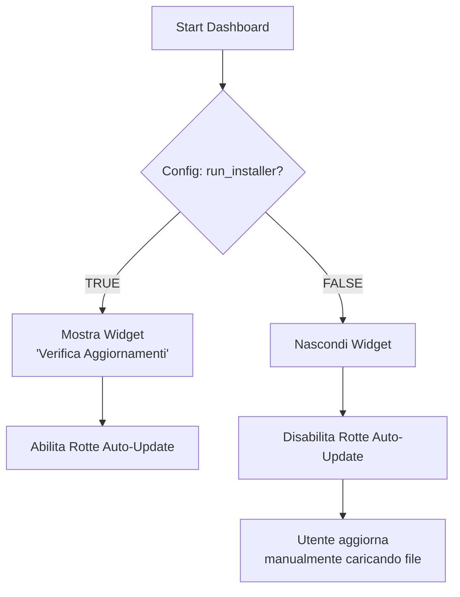
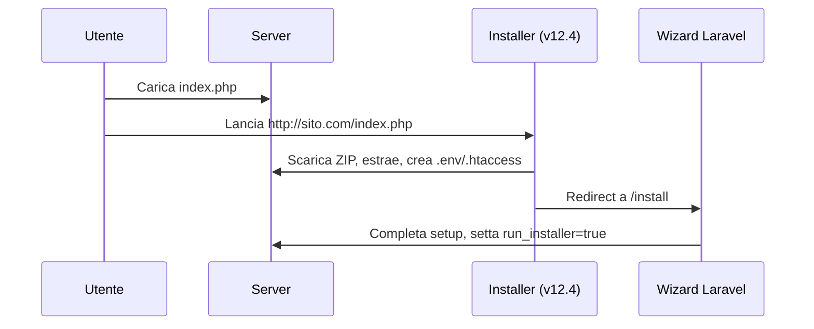
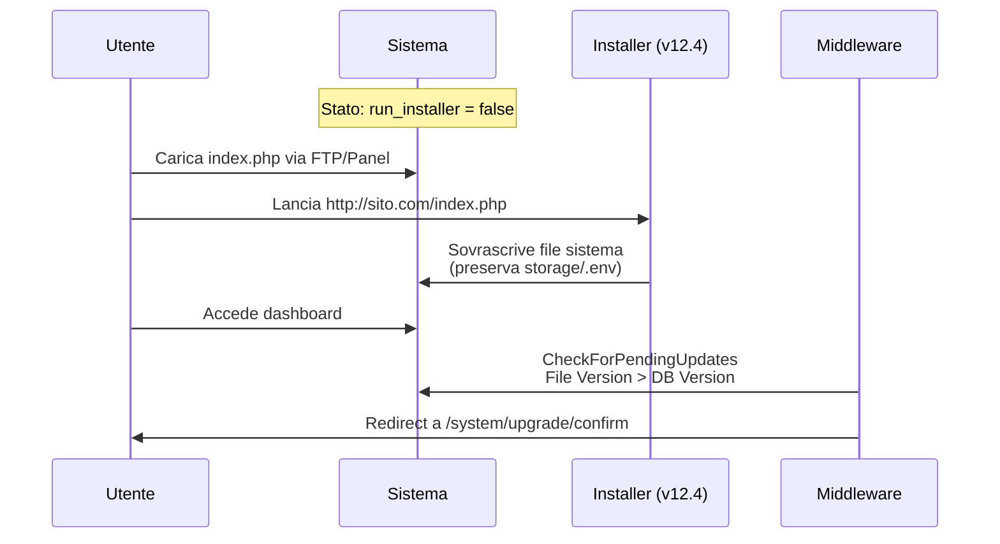
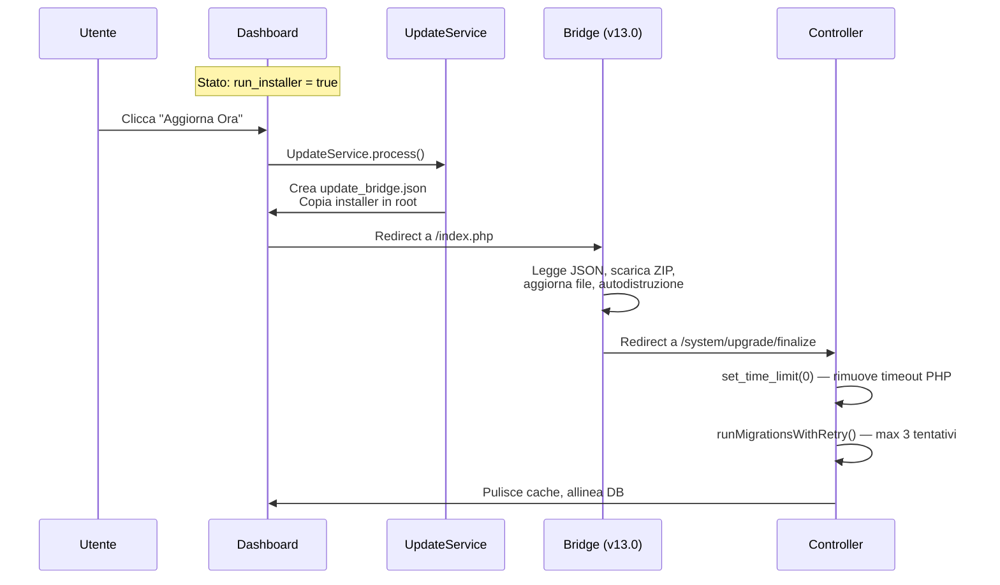
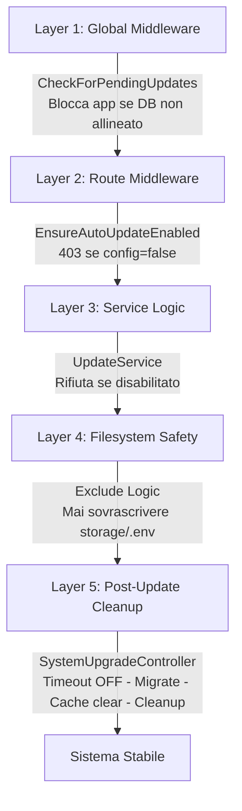

```markdown
# KondoManager Update System Bible

> **Architettura di aggiornamento automatico/manuale - Documentazione tecnica completa**

| Metadata | Value |
|----------|-------|
| **Versione Architettura** | 2.0.0 |
| **Ultima Modifica** | 03 Maggio 2026 |
| **Stato** | Production |
| **Autori** | KondoManager Dev Team |

---

## Indice

1.  [Il Cuore Logico](#1-il-cuore-logico-wizard-vs-manuale)
2.  [Scenari Operativi](#2-scenari-operativi)
3.  [L'Arsenale (File System)](#3-larsenale-file-system)
4.  [I 5 Livelli di Protezione](#4-i-5-livelli-di-protezione-)
5.  [Migration Safety (Hosting Condivisi)](#5-migration-safety-hosting-condivisi)
6.  [Checklist di Rilascio](#6-checklist-di-rilascio-production)
7.  [Risoluzione Problemi](#7-risoluzione-problemi)

---

## 1. Il Cuore Logico (Wizard vs Manuale)

Il sistema decide se abilitare gli aggiornamenti automatici basandosi su una singola variabile di configurazione in `config/installer.php`.

### Diagramma Decisionale



### Tabella dei Comportamenti

| Tipo Installazione | Config (`installer.run_installer`) | Dashboard UI | Metodo Aggiornamento |
|-------------------|-----------------------------------|--------------|---------------------|
| **Via Wizard** | `true` | ✅ Bottone "Cerca Aggiornamenti" | Automatico (One-Click) |
| **Manuale (FTP)** | `false` | ❌ Nascosto | Manuale (Upload `index.php`) |

---

## 2. Scenari Operativi

### SCENARIO 1: Nuovo Cliente (Fresh Install)



**Passaggi:**
1. **Azione:** Utente scarica `index.php` (v12.4 Standalone) e lo carica sul server
2. **Esecuzione:** Lancia `http://sito.com/index.php`
3. **Setup:** L'installer scarica lo ZIP, estrae, crea `.env` e `.htaccess`
4. **Redirect:** Porta l'utente a `/install`
5. **Risultato:** Laravel Wizard completa il setup e setta `run_installer = true`

### SCENARIO 2: Aggiornamento Manuale (1.7 → 1.8)

*Utile per hosting restrittivi o senza permessi CURL*



**Passaggi:**
1. **Stato:** Cliente ha `run_installer = false`
2. **Azione:** Utente carica `index.php` (v12.4 Standalone) via FTP/Panel
3. **Esecuzione:** Lancia `http://sito.com/index.php`
4. **Processo:** L'installer sovrascrive i file di sistema (preservando `storage` e `.env`)
5. **Middleware:** Al rientro in dashboard, `CheckForPendingUpdates` nota che `File Version > DB Version`
6. **Risultato:** Redirect forzato a `/system/upgrade/confirm` per lanciare le migrazioni

### SCENARIO 3: Aggiornamento Automatico (Bridge)



**Passaggi:**
1. **Stato:** Cliente ha `run_installer = true`
2. **Azione:** Clicca "Aggiorna Ora" in Dashboard
3. **Backend:** `UpdateService` crea `update_bridge.json` e copia l'installer interno in root
4. **Processo:** Redirect a `/index.php` (v13.0 Bridge)
5. **Esecuzione:** Il Bridge legge il JSON, scarica lo ZIP, aggiorna i file e si autodistrugge
6. **Risultato:** Redirect a `/system/upgrade/finalize`. Il controller rimuove il timeout PHP, esegue le migration con retry logic (max 3 tentativi), pulisce la cache e allinea il DB

---

## 3. L'Arsenale (File System)

### Gli Installer (Frontend)

| Tipo | File | Posizione Repo | Scopo | Note |
|------|------|----------------|-------|------|
| **Standalone** | **v12.4** | Distribuito a parte (non versionato nel repo) | Nuovi Clienti / Manual Update | Hash Hardcoded. Grafica Premium. Crea .htaccess. Caricato come `index.php` in root, si autoelimina a fine esecuzione (o alla ricarica se l'unlink fallisce, mostrando 410 Gone). |
| **Bridge** | **v13.0** | `resources/installer/index.php` | Auto-Update Interno | Hash dinamico (dal JSON). Minimalista. Git-Safe. |

### Il Backend (Laravel)

| Componente | File | Responsabilità |
|------------|------|----------------|
| **Service** | `app/Services/UpdateService.php` | Scarica JSON remoto, prepara il Bridge, invalida cache aggiornamenti |
| **Controller** | `app/Http/Controllers/System/SystemUpgradeController.php` | Gestisce UI, Timeout Safety, Migrazioni con Retry Logic (max 3 tentativi), Cleanup |
| **Middleware** | `app/Http/Middleware/EnsureAutoUpdateEnabled.php` | Protegge le rotte `/system/upgrade/*` |
| **Middleware** | `app/Http/Middleware/CheckForPendingUpdates.php` | Blocca l'app se il DB non è allineato ai file |

### Il Cloud (Server Remoto)

| File | Contenuto | Esempio |
|------|-----------|---------| 
| `packages/latest.json` | Versione, hash, url, requirements, exclude list | [Vedi esempio](#) |
| `packages/km_v1.8.0.zip` | Software completo (deve contenere `resources/installer/index.php`) | N/A |

**Esempio `latest.json`:**
```json
{
  "version": "1.8.0",
  "hash": "sha256:abc123...",
  "url": "https://updates.kondomanager.com/packages/km_v1.8.0.zip",
  "exclude": ["storage", ".env", "install.log", "update_bridge.json"],
  "requirements": {
    "php": "8.1",
    "laravel": "10.0"
  }
}
```

---

## 4. I 5 Livelli di Protezione 



### 1. **Livello 1 - Global Middleware**
```php
// File: app/Http/Middleware/CheckForPendingUpdates.php
public function handle($request, Closure $next)
{
    if ($this->needsDatabaseUpgrade()) {
        return redirect()->route('system.upgrade.confirm');
    }
    return $next($request);
}
```
*Controlla ogni richiesta HTTP. Se `File Version > DB Version` → STOP → Redirect.*

### 2. **Livello 2 - Route Middleware**
```php
// File: app/Http/Middleware/EnsureAutoUpdateEnabled.php
public function handle($request, Closure $next)
{
    if (!config('installer.run_installer')) {
        abort(403, 'Aggiornamento automatico disabilitato');
    }
    return $next($request);
}
```
*Protegge le rotte `/system/upgrade/*`. Se config è `false` → 403.*

### 3. **Livello 3 - Service Logic**
```php
// File: app/Services/UpdateService.php
public function prepareBridgeUpdate()
{
    if (!config('installer.run_installer')) {
        throw new UpdateDisabledException();
    }
    // ... procede con la creazione del bridge
}
```
*Logica interna. Rifiuta di generare il Bridge se la configurazione è disabilitata.*

### 4. **Livello 4 - Filesystem Safety**
*Entrambi gli installer (v12.4 e v13.0) rispettano:*
- Mai sovrascrivere `storage/`
- Mai sovrascrivere `public/uploads/`
- Mai sovrascrivere `.env` (tranne backup/restore)
- Rispettano la `exclude_list` dal `latest.json`

### 5. **Livello 5 - Post-Update Cleanup**

Il metodo `run()` del controller esegue i seguenti passi in ordine:

```php
// File: app/Http/Controllers/System/SystemUpgradeController.php
public function run()
{
    // 0. TIMEOUT SAFETY — rimuove il limite PHP prima di qualsiasi operazione lunga.
    //    Artisan::call('migrate') gira nello stesso processo HTTP e ne eredita il timeout.
    //    set_time_limit + ini_set coprono entrambi i meccanismi SAPI (Windows + Linux).
    set_time_limit(0);
    ini_set('max_execution_time', '0');

    // 1. Migrazioni con retry logic (max 3 tentativi, 2s di pausa tra un tentativo e l'altro)
    $this->runMigrationsWithRetry();

    // 2. Allinea la versione nel DB bypassando il singleton Spatie (che potrebbe
    //    restituire il valore cached dalla richiesta precedente all'aggiornamento)
    DB::table('settings')
        ->where('group', 'general')
        ->where('name', 'version')
        ->update(['payload' => json_encode(config('app.version'))]);

    // 3. Pulizia cache applicativa
    Artisan::call('optimize:clear');
    Artisan::call('view:clear');
    Artisan::call('route:clear');

    // 4. Invalida la cache del middleware CheckForPendingUpdates e la cache
    //    dell'UpdateService (evita che il banner "aggiorna" riappaia subito dopo)
    Cache::forget('system.needs_upgrade');
    app(UpdateService::class)->clearUpdateCache();

    // 5. Ripara il symlink storage se l'installer lo ha rimosso
    $this->ensureStorageLink();

    // 6. Rimuove file installer residui (bridge index.php) e backup > 24h
    $this->cleanupInstallerJunk();
    $this->cleanupOldBackups();
}
```

**Retry Logic (`runMigrationsWithRetry`):**
```php
private function runMigrationsWithRetry(int $maxAttempts = 3): void
{
    set_time_limit(0); // ribadito anche qui per sicurezza nel metodo interno
    $attempts = 0;

    while ($attempts < $maxAttempts) {
        try {
            Artisan::call('migrate', ['--force' => true]);
            return; // successo
        } catch (\Exception $e) {
            $attempts++;
            if ($attempts >= $maxAttempts) {
                throw new \Exception("Migration failed after {$maxAttempts} attempts: " . $e->getMessage());
            }
            Log::warning("Migration attempt {$attempts} failed, retrying in 2s...");
            sleep(2);
        }
    }
}
```

---

## 5. Migration Safety (Hosting Condivisi)

> Questa sezione documenta il pattern obbligatorio per tutte le migration che eseguono `ALTER TABLE` con piu colonne o indici.

### Il Problema: Timeout a Meta Migration

Su hosting condivisi (Netsons, SiteGround, Aruba) con PHP-FPM, `max_execution_time` puo interrompere una migration `ALTER TABLE` a meta esecuzione. La successiva chiamata a `migrate` trova colonne parzialmente create e fallisce con:

- `Duplicate column name 'xxx'` — la colonna era gia stata aggiunta prima del timeout
- `Can't DROP 'xxx'; check that it exists` — l'indice non era ancora stato creato quando il cleanup tenta di dropparlo

### La Soluzione: Pattern cleanupPartialMigration

Ogni migration con 2+ colonne o con indici composti **deve** implementare questo pattern:

```php
public function up(): void
{
    $this->cleanupPartialMigration(); // prima di qualsiasi DDL
    
    Schema::table('mia_tabella', function (Blueprint $table) {
        $table->string('colonna_a')->nullable();
        $table->foreignId('fk_id')->nullable()->constrained('altra_tabella')->nullOnDelete();
        $table->index(['col1', 'fk_id'], 'idx_mio_indice_composito');
    });
}

private function cleanupPartialMigration(): void
{
    $orphans = array_filter($this->columns, fn($col) => Schema::hasColumn('mia_tabella', $col));

    if (empty($orphans)) return;

    Log::warning('Partial migration detected on [mia_tabella]', ['orphans' => array_values($orphans)]);

    Schema::table('mia_tabella', function (Blueprint $table) use ($orphans) {
        if (in_array('fk_id', $orphans)) {
            $table->dropForeign(['fk_id']);

            // GUARD INDICE OBBLIGATORIA: l'indice potrebbe non esistere se il timeout
            // e avvenuto dopo ADD COLUMN ma prima di ADD INDEX
            $indexExists = DB::select("
                SELECT COUNT(*) as cnt
                FROM information_schema.STATISTICS
                WHERE table_schema = DATABASE()
                AND table_name = 'mia_tabella'
                AND index_name = 'idx_mio_indice_composito'
            ");
            if ($indexExists[0]->cnt > 0) {
                $table->dropIndex('idx_mio_indice_composito');
            }
        }
        $table->dropColumn(array_values($orphans));
    });
}
```

### Regole Obbligatorie

| Regola | Perche |
|--------|--------|
| `set_time_limit(0)` in cima all'`up()` delle data migration | Le migration con loop su record esistenti possono durare minuti su DB grandi |
| Usare `lazy()` invece di `all()` sui loop Eloquent | Evita OOM su installazioni con molti record — `lazy()` usa un cursor DB |
| Preferire `DB::join()` a `whereHas()` nelle data migration | `whereHas` genera subquery correlate non ottimizzate; `DB::join()` usa gli indici FK |
| Guard `information_schema.STATISTICS` prima di ogni `dropIndex` nel cleanup | L'indice potrebbe non esistere se il timeout e avvenuto tra `ADD COLUMN` e `ADD INDEX` |

### Migration di Riferimento

| Migration | Pattern Implementato |
|-----------|---------------------|
| `2026_04_19_hardening_legale_e_tracciabilita_fatture` | cleanupPartialMigration + guard information_schema su idx_recupero_crediti — migration di riferimento |
| `2026_03_16_add_fornitore_and_description_to_saldi_table` | Guard information_schema su idx_saldi_condominio_fornitore in cleanup e down (fix v1.9.28) |
| `2026_03_27_add_mastri_costo_e_ripara_voci_orfane` | set_time_limit(0) + lazy() + DB::join() per data migration efficiente (fix v1.9.28) |

---

## 6. Checklist di Rilascio (Production)

> Copia questa checklist in ogni ticket di rilascio

### **Pre-Rilascio**
- [ ] **App Version:** `config/app.php` aggiornato alla nuova versione
- [ ] **Changelog:** Aggiornato `docs/changelog.md` con tutte le modifiche
- [ ] **Database:** Verificate migrazioni e seeder (se presenti)
- [ ] **Migration Safety:** Ogni nuova migration con 2+ colonne ha `cleanupPartialMigration` con guard `information_schema` sugli indici

### **Creazione Pacchetto**
- [ ] **Bridge Check:** Verificato che `resources/installer/index.php` sia presente dentro lo ZIP
- [ ] **Hash ZIP:** Creato SHA256 dello ZIP e inserito in `latest.json`
- [ ] **Setup Standalone:** Aggiornate costanti `PACKAGE_HASH` e `PACKAGE_URL` nel file `index.php` standalone (distribuito a parte, non nel repo)
- [ ] **Exclude List:** Verificato che `latest.json` abbia exclude list corretta
- [ ] **Requirements:** Aggiornati requisiti PHP/Laravel se necessari

### **Test**
- [ ] **Test Download:** Verificato che il link nel JSON sia pubblicamente accessibile
- [ ] **Test Hash:** Verificato che l'hash dello ZIP corrisponda
- [ ] **Scenario 1:** Testata installazione da zero
- [ ] **Scenario 2:** Testato aggiornamento manuale (config false)
- [ ] **Scenario 3:** Testato aggiornamento automatico (config true)
- [ ] **Rollback:** Testata procedura di rollback in caso di errore
- [ ] **Hosting Condiviso:** Testato su ambiente con `max_execution_time = 60` (simula Netsons/Aruba)

### **Deploy**
- [ ] **Backup:** Backup completo del server remoto
- [ ] **Upload:** Caricato `km_vX.X.X.zip` sul server CDN
- [ ] **JSON Aggiornato:** Sostituito `latest.json` con la nuova versione
- [ ] **Monitoraggio:** Attivato logging per le prime 24 ore

---

## 7. Risoluzione Problemi

### Errori Comuni

| Problema | Causa Probabile | Soluzione |
|----------|-----------------|-----------| 
| **"Hash mismatch"** | File ZIP corrotto o hash errato nel JSON | Ricreare ZIP, ricalcolare hash, aggiornare `latest.json` |
| **Bridge non si autodistrugge** | Permessi filesystem | Verificare che PHP abbia permessi di scrittura sulla root |
| **"Update disabled" (403)** | `run_installer = false` | Usare aggiornamento manuale (Scenario 2) |
| **Loop di redirect** | Cache middleware non invalidata | Eseguire `php artisan cache:clear` manualmente |
| **Symlink storage rotto** | Installer ha sovrascritto `public/storage` | Eseguire `php artisan storage:link` |
| **"Duplicate column name"** | Timeout durante migration precedente, colonna orfana rimasta | Verificare che la migration abbia `cleanupPartialMigration`. Se assente, droppare manualmente la colonna e rilanciare `migrate`. |
| **"Can't drop index ... check that it exists"** | Timeout tra ADD COLUMN e ADD INDEX — cleanup assume che l'indice esista | Aggiungere guard `information_schema.STATISTICS` nel cleanup. Fix presente dalla v1.9.28 sulle migration critiche. |
| **Error 1267 Illegal mix of collations** | `JSON_UNQUOTE()` restituisce stringa con collation connessione, diversa dalla collation della tabella — tipico su hosting con `utf8mb3_general_ci` come default server | Wrappare con `CONVERT(JSON_UNQUOTE(...) USING utf8mb4)` nei `whereRaw`. Fix applicato su `RecurrenceService` e `InboxService` dalla v1.9.28. |

### Debug

```bash
# Verifica versione file vs database
php artisan app:version-check

# Forza pulizia cache completa
php artisan cache:clear
php artisan config:clear
php artisan route:clear
php artisan view:clear

# Verifica permessi storage
chmod -R 755 storage
chown -R www-data:www-data storage

# Verifica colonne orfane (da eseguire se migrate fallisce con Duplicate column)
SELECT TABLE_NAME, COLUMN_NAME 
FROM information_schema.COLUMNS 
WHERE TABLE_SCHEMA = DATABASE() 
AND TABLE_NAME IN ('saldi', 'rate_quote', 'conti', 'righe_fattura', 'piani_rate');
```

### Supporto Tecnico
- **Logs:** Controllare `storage/logs/laravel.log`
- **Install Log:** Controllare `install.log` (se presente)
- **Bridge Debug:** Il file `update_bridge.json` contiene l'ultimo stato dell'aggiornamento

---

## Changelog Documentazione

| Versione | Data | Modifiche |
|----------|------|-----------|
| 1.0.0 | 01/02/2026 | Documentazione iniziale completa |
| 1.1.0 | 01/02/2026 | Aggiunta sezione troubleshooting, ottimizzato per GitHub |
| 2.0.0 | 03/05/2026 | Aggiornato flow run() con timeout safety e runMigrationsWithRetry (max 3 tentativi, sleep 2s); aggiunta sezione 5 Migration Safety con pattern cleanupPartialMigration, guard information_schema, regole lazy()/DB::join(), tabella migration di riferimento; aggiornato diagramma Scenario 3; tabella Backend con UpdateService.clearUpdateCache; 3 nuove voci troubleshooting (Duplicate column, drop index, Error 1267); checklist rilascio estesa con voce hosting condiviso e migration safety |

---

**KondoManager Dev Team**  
*Sistema di aggiornamento progettato per affidabilita e sicurezza*  
[Documentazione Ufficiale](https://kondomanager.com)

---

> **Nota:** Questa documentazione e viva e viene aggiornata con ogni rilascio importante. Verificare sempre la versione piu recente nel repository.
```
